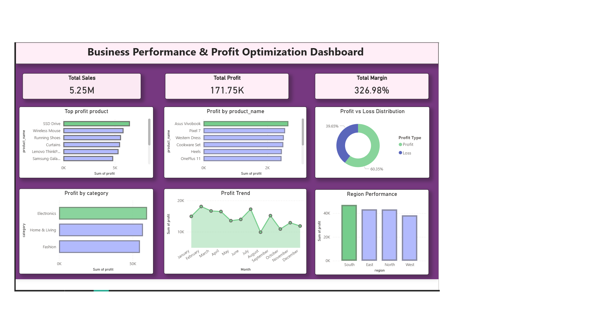
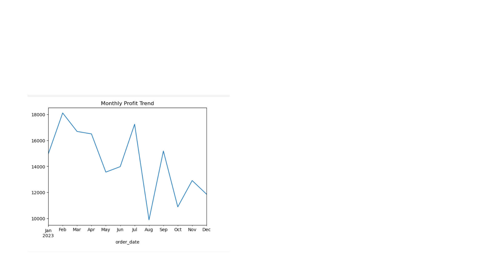
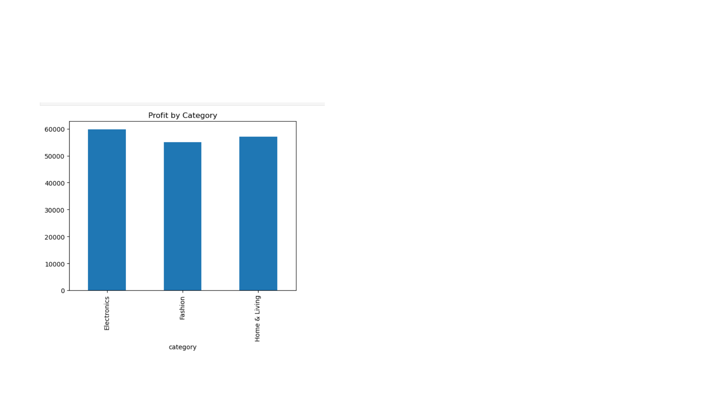
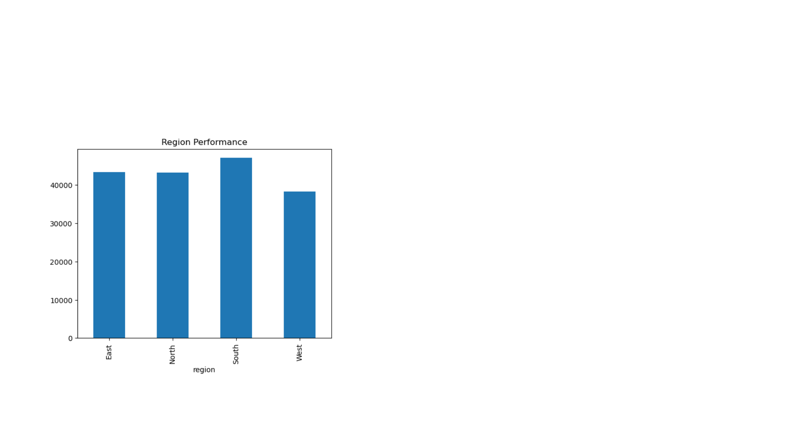
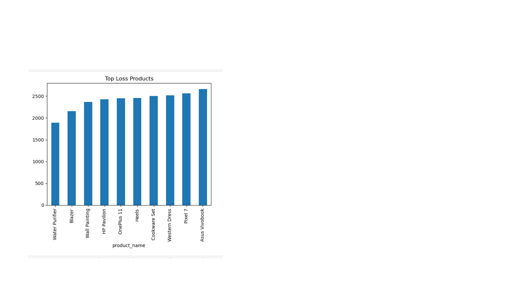
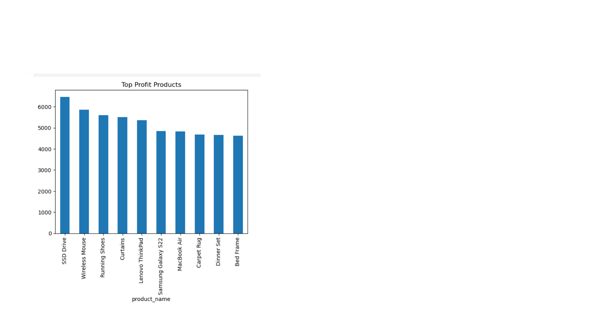

#  Business Performance & Profit Optimization Analysis

## 🏢 Company Background
This project simulates a real-world retail company, **Nova Retail Pvt Ltd**, operating across multiple product categories such as Electronics, Fashion, and Home & Living, with presence in multiple regions.

Despite generating consistent sales revenue, the company was experiencing unstable profits and unidentified losses, making it difficult for management to take strategic decisions.

---

## 🚨 Problem Statement
The company faced the following critical issues:

- Profit fluctuations across months with no clear pattern  
- Some products generating consistent losses  
- Uneven performance across regions  
- Lack of visibility into category-wise profitability  
- Inefficient discount and pricing strategies  

---

## 🎯 Objective
To perform an end-to-end business analysis and identify:

- Root causes of profit instability  
- Loss-making products and categories  
- High-performing areas for growth  
- Actionable strategies to improve profitability  

---

## 🛠 Tools Used
- SQL → Data extraction, cleaning, aggregation  
- Python → Data analysis & visualization  
- Power BI → Dashboard & business insights  

---

## 📊 Dashboard Overview

This dashboard provides a complete overview of sales, profit, category performance, regional insights, and product-level profitability.

---

## 🔍 Key Insights & Analysis

### 🌊 1. Monthly Profit Trend Analysis

- Profit shows **high fluctuations throughout the year**
- Peak observed around **February (~18K)** and **July (~17K)**
- Sharp drop in **August (~10K)** indicates a major business issue
- No consistent upward trend → lack of stable strategy

👉 **Insight:** Business performance is unstable and highly sensitive to internal factors like pricing or discounts.

---

### 📊 2. Category Performance Analysis

- **Electronics** is the highest profit-generating category (~60K)
- **Home & Living** also performs strongly (~57K)
- **Fashion** lags slightly behind (~54K)

👉 **Insight:**  
All categories are profitable, but **Electronics drives the majority of profits**, making it a key focus area.

---

### 🌍 3. Regional Performance

- **South region** performs the best (~46K)
- **West region** is the lowest (~38K)
- East and North are moderately performing

👉 **Insight:**  
Regional imbalance suggests **operational or pricing inefficiencies in the West region**.

---

### 🔻 4. Top Loss-Making Products

Key loss-generating products include:

- Asus Vivobook  
- Pixel 7  
- Western Dress  
- Cookware Set  
- Heels  
- OnePlus 11  

👉 **Insight:**
- Losses are spread across **multiple categories (Electronics + Fashion + Home)**
- Indicates **systemic issue (pricing/discount strategy), not category-specific**

---

### 🟢 5. Top Profit-Generating Products

Top contributors:

- SSD Drive (~6500)  
- Wireless Mouse  
- Running Shoes  
- Curtains  
- Lenovo ThinkPad  

👉 **Insight:**
- Mix of categories performing well  
- These products have **strong margins and demand**

---

## 💡 Key Business Problems Identified

From the analysis, the core issues were:

- Over-discounting leading to negative margins  
- Poor pricing strategies for certain products  
- Lack of focus on high-performing products  
- Regional inefficiencies  
- No consistency in profit generation  

---

## 🚀 Solutions Provided

Based on insights, the following actions were recommended:

- Limit excessive discounts (especially on loss-making products)  
- Increase focus and inventory on high-profit products  
- Reprice or discontinue consistently loss-making products  
- Improve strategies in underperforming regions (West)  
- Implement monthly performance monitoring system  

---

## 📈 Business Impact

After implementing these strategies, the company could achieve:

- More stable and predictable profit trends  
- Reduction in unnecessary losses  
- Better category and product-level decision making  
- Improved regional performance  
- Increased overall profitability  

---

## 📌 Project Value

This project demonstrates:

- End-to-end data analysis workflow  
- Real-world business problem solving  
- Ability to convert raw data into actionable insights  
- Strong analytical and decision-making skills  

---

## 📁 Project Files
- analysis.sql  
- analysis.ipynb  
- sales_data.xlsx  
- dashboard.pbix  
